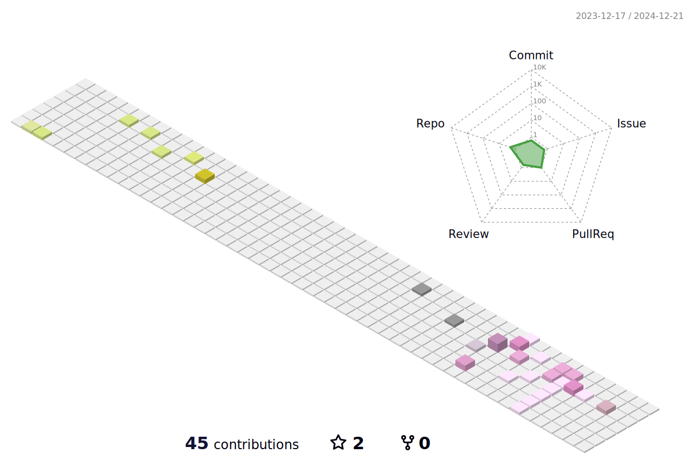

<h1> Hey! Nice to see you.</h1>

<p>I am a front-end engineer 🌱 , and also a full-stack developer, committed to become a good independent developer and open source contributor, recently interesting and practicing in lowcode, serverless, vite, SwiftUI, and Flutter。</p>

[](https://github.com/noviclos)
[](https://juejin.cn/user/272334611548173)
[](https://noviclos.com/)

### 🛠 Platforms, languages and tools

**Web Developer**


<p>
  
  
  
  
  
  
  
  
</p>

**Backend Developer**

<p>
  
  
  
  
  
</p>

**Android Developer**

<p>


</p>

**DevOps**

<p>
  
  
  
  
</p>

**Environment**

<p>
  
  
</p>

### 📫 Contact me:

- Website: [noviclos.com](https://noviclos.com/)
- Email: [noviclos@outlook.com](mailto:noviclos@outlook.com)
- X: [@noviclos](https://x.com/noviclos)

You can also ask me a question on my [Public AMA](https://github.com/noviclos/noviclos/discussions/new?category=ama)

My GPG key hosted here at [GitHub](https://github.com/noviclos.gpg) and also [Keybase](https://keybase.io/noviclos/pgp_keys.asc), see [Keybase proof](https://gist.github.com/noviclos/3c0efd4abbfd1cbb116de499626da716).



<details>
  <summary>:notebook: Some statistics ...</summary><br/>

<!--START_SECTION:waka-->


**🐱 My GitHub Data** 

> 📦 640.3 kB Used in GitHub's Storage 
 > 
> 🏆 63 Contributions in the Year 2024
 > 
> 💼 Opted to Hire
 > 
> 📜 3 Public Repositories 
 > 
> 🔑 314 Private Repositories 
 > 
**I'm an Early 🐤** 

```text
🌞 Morning                19 commits          █████████░░░░░░░░░░░░░░░░   35.85 % 
🌆 Daytime                20 commits          █████████░░░░░░░░░░░░░░░░   37.74 % 
🌃 Evening                14 commits          ███████░░░░░░░░░░░░░░░░░░   26.42 % 
🌙 Night                  0 commits           ░░░░░░░░░░░░░░░░░░░░░░░░░   00.00 % 
```
📅 **I'm Most Productive on Thursday** 

```text
Monday                   12 commits          ██████░░░░░░░░░░░░░░░░░░░   22.64 % 
Tuesday                  11 commits          █████░░░░░░░░░░░░░░░░░░░░   20.75 % 
Wednesday                10 commits          █████░░░░░░░░░░░░░░░░░░░░   18.87 % 
Thursday                 14 commits          ███████░░░░░░░░░░░░░░░░░░   26.42 % 
Friday                   2 commits           █░░░░░░░░░░░░░░░░░░░░░░░░   03.77 % 
Saturday                 3 commits           █░░░░░░░░░░░░░░░░░░░░░░░░   05.66 % 
Sunday                   1 commits           ░░░░░░░░░░░░░░░░░░░░░░░░░   01.89 % 
```


📊 **This Week I Spent My Time On** 

```text
🕑︎ Time Zone: Asia/Shanghai

💬 Programming Languages: 
No Activity Tracked This Week

🔥 Editors: 
No Activity Tracked This Week

💻 Operating System: 
No Activity Tracked This Week
```

**I Mostly Code in TypeScript** 

```text
TypeScript               57 repos            ██████░░░░░░░░░░░░░░░░░░░   22.89 % 
Swift                    57 repos            ██████░░░░░░░░░░░░░░░░░░░   22.89 % 
Vue                      43 repos            ████░░░░░░░░░░░░░░░░░░░░░   17.27 % 
Java                     7 repos             █░░░░░░░░░░░░░░░░░░░░░░░░   02.81 % 
SCSS                     1 repo              ░░░░░░░░░░░░░░░░░░░░░░░░░   00.40 % 
```


 Last Updated on 08/09/2024 01:16:23 UTC
<!--END_SECTION:waka-->

<a href="https://github.com/noviclos#gh-light-mode-only"></a>
<a href="https://github.com/noviclos#gh-dark-mode-only"></a>
</details>
